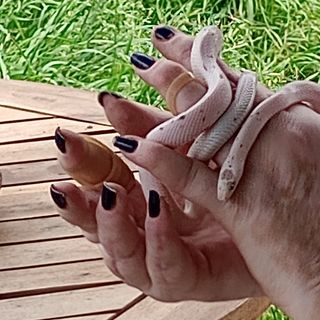

## Breeding Stock
### Rock (Corn Snake)

Classic corn Het. for Orchid,Palmetto, and Caramel. Produced by Rock Creek Corns in June 22'.

[TikTok](https://www.tiktok.com/@kathysabry/video/7253833252975152430?lang=en)

### Pollianna (Corn Snake)

Classic Polmetto Het. for Butter. Produced by Rock Creek Corns in Sep. 21'

[TikTok](https://www.tiktok.com/@kathysabry/video/7253819653938531626?lang=en)

### Ivory (Corn Snake)

Ivory was purchased in a pet store so we don't know if she has unknown hets we estimate she was hatched in June 22'. Her visual morph is snow stripe, so her known genes are stripe, anery and amel.

[TikTok](https://www.tiktok.com/@kathysabry/video/7253814343291374894?lang=en)

### Skinderella (Corn Snake)

Skinderella is a scaleless okeetee produced by Premium Reptiles on 7/7/23. She is Het. for Anery and amel.

### Sugar (Corn Snake)

Sugar is a Carolina Locality wild type with unknown hets.

### Tess (Corn Snake)

Tess was produced by South Mountain Reptiles, she is a tessera het for Motley and Possibly het for Pied Sided.

### Munch (Tokay Gecko)

Produced by us she is the daughter of Monster and an un named female who was a Platinum. She hatched in Feb. 21' and was the larger of the 2. Both Parents are wild caught so Munch is a first generation CB. She is Het Platinum, we don't knoe if her father has any hidden hets but hope to find out with this pairing.

### Crunch and Monster (Tokay Gecko)

Crunch is the other female produced by monster and the Platinum female, thus making her Het. Platinum hatched in Feb.2021 this will be her first year breeding for 2024.

