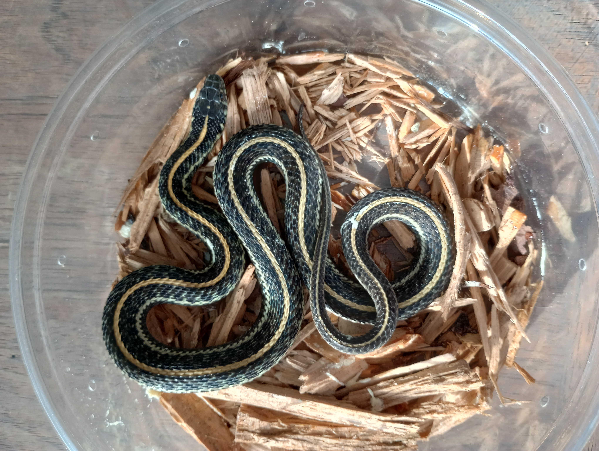
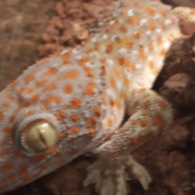
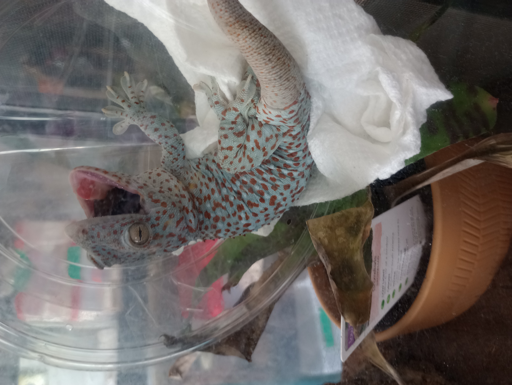

## Breeding Stock
Our future breeders will not be bred until they are the appropriate age, size and in good health.
### Rock (Corn Snake)

Classic corn Het. for Orchid,Palmetto, and Caramel. Produced by Rock Creek Corns in June 22'.

[TikTok](https://www.tiktok.com/@kathysabry/video/7253833252975152430?lang=en)

### Pollianna (Corn Snake)

Classic Polmetto Het. for Butter. Produced by Rock Creek Corns in Sep. 21'

[TikTok](https://www.tiktok.com/@kathysabry/video/7253819653938531626?lang=en)

### Ivory (Corn Snake)

Ivory was purchased in a pet store so we don't know if she has unknown hets we estimate she was hatched in June 22'. Her visual morph is snow stripe, so her known genes are stripe, anery and amel.

[TikTok](https://www.tiktok.com/@kathysabry/video/7253814343291374894?lang=en)

### Skinderella (Corn Snake)

Skinderella is a scaleless okeetee produced by Premium Reptiles on 7/7/23. She is Het. for Anery and amel.

### Sugar (Corn Snake)

Sugar is a Carolina Locality wild type with unknown hets.

### Tess (Corn Snake)

Tess was produced by South Mountain Reptiles, she is a tessera het for Motley and Possibly het for Pied Sided.

### Wednesday (Corn Snake)

Wednesday is a single gene cornsnake, just Anery, probably the one with the least genetics besides Sugar. She was hatched June 22'.

### Ziggy Stardust (Corn Snake)

Produced by Prismatic Corns, Ziggy was hatched June of 22'. Ziggy is a scaleless het for Blood Red, Anery, Caramel, Hypo, Amel, Lavender and Motley. Ziggy is a powerhouse of genetics and I look forward to pairing him with my Palmetto to produce multiple variations of the Palmetto Morph.

[TikTok](https://www.tiktok.com/@kathysabry/video/7253835348340542766?lang=en)

### 50 50 (Corn Snake)

50 50 is a purchase from a petstore and until we breed him we won't know if he has hidden hets. Visually we can see he is an Amel Hurricain Motley.

[TikTok](https://www.tiktok.com/@kathysabry/video/7253829165932236074?lang=en)

### Bloody Marty (Corn Snake)

Bloody Marty is a blood red morph who is Het for Scaleless and Amel.  He was produced by Exotics by Nature and hatched June of 23'.

### Casiopia (Garter Snake)

Casiopia is a Radix Plains Garter Snake, produced by Garters Dunn Right, she was born in March of 23' and is het for Albino, Melanistic and Blue Black Axanthic.

[TikTok](https://www.tiktok.com/@kathysabry/video/7299540993362218283?lang=en)

### Munch (Tokay Gecko)

Produced by us she is the daughter of Monster and an un named female who was a Platinum. She hatched in Feb. 21' and was the larger of the 2. Both Parents are wild caught so Munch is a first generation CB. She is Het Platinum, we don't knoe if her father has any hidden hets but hope to find out with this pairing.

### Crunch and Monster (Tokay Gecko)

Crunch is the other female Fathered by monster and the Platinum female, thus making her Het. Platinum hatched in Feb.2021 this will be her first year breeding for 2024. Monster is a wild caught male so we don't know if he has any hidden hets. We hope to find out when he produces offspring with his daughter in the 2024 season.

### un named (Tokay Gecko)

She is a new addition and was sold to us as a male but turned out to be female. She is wild caught and is being brought to a healthy weight before we pair her with a male.

### Nibler (Tokay Gecko)

Nibler is also wild caught and was sold to us as a male but turned out to be a female. She may posess unknown hets and has been brought to a healthy weight but I don't have a spare male to pair her with at this time.

### Chomper (Tokay Gecko)

Chomper was purchased from Emerald Exotics and was recently paired with Munch but they didn't sucessfully produce any eggs. They were paired for almost 3 months when suddenly he was being injured by munch so he has been seperated to recoup from his injuries. I hope to pair him with Nibler. He is Captive bred and a proven producer of Granite offspring.

### Amber (Crested gecko)

Amber is a Bi color female when fired up she is red and orange, she has faint brindle markings when fired as well.

### Big Daddy (Crested gecko)

Big Daddy is an Super Cream Extream Harlequin, pos Het Sable male with a big head and crests.  He has produced a lot of babies over the years but I haven't hung on to any long enough to see their progression.

### Pos Sable holdback (Crested gecko)

### Pos Sable holdback (Crested gecko)

This is an offspring of Big Daddy, I only just learned about the Sable gene and when they were talking about the look of the babies it had striking resemblance to his offspring.  They are described as having orangish coration and dark tips on the tails, which nearly all his offspring have had.  So I am going to hold this one back and see if the white brightenes and expands on the crests and body.

### Dalmation Pair (Crested gecko)

The male when fired up is a pewter gray color with black spots and the female is a cream harlequin with dalmation spots.
